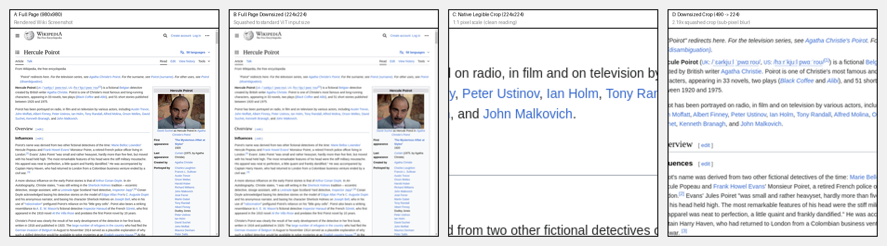
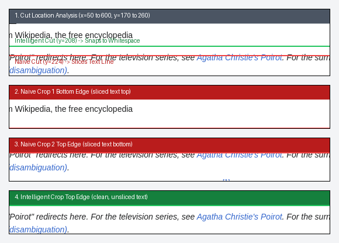
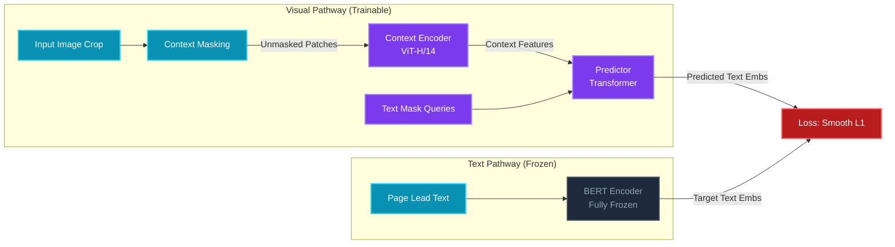

# Slide 1: Can Vision Models Read? (0:00 - 0:30)
## Can Vision Models Read?
### A Study of Visual Document Retrieval and Latent Text Representations
* **Authors:** Barış Cem Bakay, Halil İbrahim Kanpak
* **Affiliation:** Department of Computer Engineering, Koç University
* **Goal:** Present visual page retrieval benchmarks across vision pretrainings, investigate the layout shortcut confound, and scale self-supervised predictive encoders (I-JEPA) to native resolution.

---
# Slide 2: Background: The Visual Document Paradigm (0:30 - 1:15)
## OCR-Free Visual Document AI
* **The Traditional Pipeline:** OCR Engine $\to$ Text Parser $\to$ Dense Text Encoder.
  * *Fragility:* Sensitive to scan noise, layout complexity, multilingual fonts, and math notation. Discards visual/spatial layout hierarchy.
* **The OCR-Free Visual Alternative:** Feed raw page screenshots directly to a vision encoder.
  * *Advantage:* Preserves all formatting, tables, figures, fonts, and multilingual context in a single visual pass.
* **The Core Question:** Do standard general-purpose vision encoders (pretrained on natural images or image-caption pairs) naturally learn to "read" visual text, or do they only match spatial layout fingerprints?

---

# Slide 3: Motivation & Research Questions (1:15 - 2:00)
## OCR-Free Visual Retrieval
* **The Goal:** Bypass traditional text pipelines (OCR + text encoders) to retrieve document pages directly using page screenshots, preserving layout, figures, and formatting.
* **Core Research Inquiries:**
  * **Q1 (Zero-Shot Encoders):** Which vision pretrainings inherently align with visual text features zero-shot?
  * **Q2 (Platonic Hypothesis):** Do vision space and text space align representationally as model scale grows?
  * **Q3 (Unsupervised Reading):** Does image-only predictive pretraining (I-JEPA) encode latent linguistic features?
  * **Q4 (The Shortcut Confound):** Do models actually read body text, or do they exploit layout cues (like titles)?
  * **Q5 (Text-Target JEPA):** Can cross-modal (Text-Target) pretraining inside I-JEPA construct stronger text representations than pure image-only pretraining?

[FIGURE: Visual Retrieval Pipeline vs. Standard OCR + Text Retrieval]

---

# Slide 4: Phase 1 Recap: Zero-Shot & The Platonic Hypothesis (2:00 - 2:45)
## Initial Findings (Progress Report Status)
* **Zero-Shot Visual Retrieval (Protocol A, 2k pages):**
  * Image-text contrastive models (CLIP, SigLIP) dominate zero-shot page retrieval.
  * Self-supervised and image-only models (DINOv2, I-JEPA) sit near chance levels zero-shot.
* **Testing the Platonic Representation Hypothesis:**
  * Measured mutual-kNN@10 alignment between vision features and BERT text embeddings.
  * Contrastive features show strong text alignment; image-only features align poorly.
  * Strong correlation between text-alignment and retrieval recall, confirming that semantic alignment predicts retrieval success.

[FIGURE: Scatter plot of vision-text mutual-kNN alignment vs. Zero-shot Recall@10 (Spearman rho = 0.83)]

---

# Slide 5: Phase 1 Recap: Fine-Tuning & The Title Confound (2:45 - 3:30)
## Shortcut Learning vs. LEACE Erasure
* **The Fine-Tuning Paradox:** Fine-tuning DINOv2-SALAD beats zero-shot CLIP, but relies on layout shortcuts.
* **Title-Blanking Experiment:** Blanking the top 15% (title region) of pages:
  * Fine-Tuned DINOv2: Retrieval recall crashes.
  * Zero-Shot CLIP: Recall increases, proving it reads text invariants rather than matching layouts.
* **LEACE Causal Title-Erasure:** 
  * Projecting out the top "title direction" axis in feature space boosts CLIP retrieval, proving titles exist as a structured linear axis in CLIP's representation.
  * Erasing it from DINOv2 has minimal effect, confirming DINOv2 does not represent titles as distinct text concepts.

[FIGURE: Bar chart of Retrieval Recall under Title Blanking and LEACE Causal Erasure (CLIP vs. DINOv2)]

---

# Slide 6: Phase 1 Recap: I-JEPA's Latent Text Alignment (3:30 - 4:15)
## Unlocking Unsupervised Text Representation
* **The Representation Coordinate Problem:**
  * Image-only I-JEPA features have zero-shot text-alignment near chance.
  * However, is semantic text structure present but represented in a different visual basis?
* **Linear Projection Adapter:**
  * Training a simple linear projection adapter maps I-JEPA features into BERT text space.
  * Adapted I-JEPA text alignment improves by 13x, showing that image-only predictive pretraining does learn latent text structures.

| Adapter Architecture | I-JEPA (R@10) | CLIP (R@10) |
| :--- | :---: | :---: |
| Baseline (no adapter) | 0.009 | 0.008 |
| **Linear** | 0.214 | **0.715** |
| Low Rank ($r=16$) | 0.172 | 0.471 |
| Low Rank ($r=64$) | 0.212 | 0.661 |
| Low Rank ($r=256$) | 0.213 | **0.717** |
| Bottleneck ($r=64$) | 0.202 | 0.666 |
| Bottleneck ($r=256$) | 0.207 | 0.712 |
| MLP ($h=2048$) | 0.213 | 0.709 |
| **Deep MLP ($h=2048$)** | **0.219** | 0.637 |

[FIGURE: Diagram of the Linear Projection Adapter from I-JEPA visual features to BERT text space]

---

# Slide 7: Main Focus: The Resolution Bottleneck & Cropping (4:15 - 5:00)
## Shifting to Native Legibility (New Progress)
* **The Scale-Down Confound:** Phase 1 evaluations scaled 490x490 page crops down to 224x224.
  * This 2.19x shrink rendered body text sub-pixel and illegible.
  * *Implication:* Models in Phase 1 were structurally prevented from reading body text, forcing them to rely on layout shortcuts.
* **The Solution: Legible-Cropping Protocol:**
  * Process page tiles at native 490x490 resolution (1,225 tokens per crop).
  * Apply line-snapping heuristics to keep line boundaries intact.
  * Ensures that characters are fully legible for reading.

---
# Slide 8: Main Focus: Intelligent Cropping & Line Snapping (5:00 - 5:45)
## Preserving Text Semantics Across Crops
* **The Slicing Artifact:** Naive sliding-window cropping slicing through midpoints of text lines cuts characters in half, producing fragmented tokens that disrupt visual parsing.
* **The Text-Aware Solution (TextAwareCropper):**
  * Computes vertical projection profiles (row ink fraction) to map page structure.
  * Dynamically snaps vertical crop boundaries to the centers of whitespace gaps.
  * Short crops are white-padded to native dimensions rather than stretched, keeping text scale consistent.

---

# Slide 9: Main Focus: Re-Baselining the Grid & Bounds (5:45 - 6:30)
## Performance at Native Resolution
* **The Perfect-Text Upper Bound:**
  * Mean-pooling BERT text embeddings directly from the page text.
  * Represents the text-only retrieval ceiling.
* **Contrastive MAE Reader Baseline:**
  * A strong custom-trained baseline using MAE features to reconstruct/embed text.
* **Re-baselined Vision Encoders:**
  * Evaluate standard backbones at 490x490 native resolution.
  * Contrastive vision encoders retain their dominance, establishing a clean baseline for text retrieval.

| Model Family / Setup | Parameter Count | R@1 (%) | R@10 (%) | Similarity Gap |
| :--- | :---: | :---: | :---: | :---: |
| **Perfect-Text (BERT mean-pool)** | - | - | **93.8%** | +0.198 |
| **Perfect-Text (BERT CLS)** | - | - | **74.7%** | +0.176 |
| **CLIP ViT-B/16 (zero-shot)** | 150M | 56.7% | **73.6%** | +0.168 |
| **SigLIP ViT-B/16 (zero-shot)** | 203M | 52.1% | **69.7%** | +0.095 |
| **DINOv2 ViT-B/14 (CLS, zero-shot)** | 87M | 4.1% | **11.6%** | +0.033 |
| **ImageNet ViT-B/16 (zero-shot)** | 86M | 2.6% | **8.4%** | +0.015 |
| **I-JEPA ViT-H/14 (zero-shot)** | 631M | 1.5% | **5.4%** | +0.012 |
| **random ViT-B/16 (zero-shot)** | 86M | 0.9% | **4.2%** | +0.002 |
| **MAE ViT-B/16 (frozen)** | 86M | 0.9% | **3.6%** | +0.001 |
| **MAE Reader (contrastive, 6 epochs)** | 86M | - | **9.8%** | +0.318 |
| **MAE Reader (title-masked, 6 epochs)** | 86M | - | **14.3%** | +0.404 |

---

# Slide 10: Main Focus: Visual Document-Pretrained Encoders (6:30 - 7:15)
## Evaluating Document AI Models Zero-Shot
* **The Document-Pretrained Family:**
  * Evaluate visual encoders explicitly pretrained on documents or document OCR tasks.
* **Nougat (Swin Transformer):**
  * Zero-shot visual page retrieval evaluation.
  * Shows that even models trained on document layouts require explicit retrieval adaptation.
* **Pix2Struct (Google):**
  * Process document patches by bypassing standard 224x224 image compression.
  * Evaluate zero-shot retrieval capabilities to set a baseline for document-pretrained models.

| Document-Pretrained Encoder | Parameter Count | R@1 (%) | R@10 (%) | Similarity Gap |
| :--- | :---: | :---: | :---: | :---: |
| **Nougat-base (Swin Transformer)** | 74M | 1.1% | **4.9%** | +0.002 |
| **Pix2Struct** | 282M | *Running* | *Running* | *Running* |

---

# Slide 11: Main Focus: Cross-Modal Pretraining - I-JEPA with Text Targets (7:15 - 8:15)
## Predicting Language from Unmasked Image Context
* **Input & Target Flow:**
  * **Frozen BERT Text Encoder:** Takes tokenized ground-truth body text of the screenshot page crop as input. Outputs semantic text embeddings `(B, T, 768)`. Completely frozen.
  * **I-JEPA Context Visual Encoder:** Takes only unmasked visual patches of the screenshot crop. Processes via ViT-H/14 backbone (unfrozen/trainable during pretraining).
  * **Transformer Predictor:** Takes concatenated context visual tokens (with 2D positional embeddings) and target query tokens (learnable mask tokens + 1D text positional embeddings). Fully trainable.
* **Pretraining Objective:** Predict the semantic BERT embeddings of the page text from only the unmasked visual context.
* **Significance:** Forces the vision encoder to learn semantic text structures directly from visual layout and context, laying the groundwork for native-resolution document retrieval.

---

# Slide 12: Main Focus: Ongoing Experiment - Native-Resolution Training Grid (8:15 - 9:00)
## Probing High-Resolution Latent Emergence on Cluster
* **The Goal:** Benchmark standard image-only pretraining against our cross-modal text-target pretraining, and evaluate retrieval head configurations.
* **The Training Grid:**
  * Run parallel training runs using native 490x490 resolution (1,225 tokens per crop).
* **Experimental Configuration Matrix:**
  * **Image-Only Backbone:** Frozen/unfrozen I-JEPA backbone pretrained on images, comparing MLP vs. SALAD retrieval heads.
  * **Text-Target Backbone:** Unfrozen cross-modal I-JEPA backbone, comparing MLP vs. SALAD retrieval heads.
  * *Target:* Validate if text-target pretraining provides a stronger starting point for visual retrieval than pure image pretraining.

[TABLE: Experimental configuration matrix for the native resolution I-JEPA training runs]

---

# Slide 13: Main Focus: Confound Control via Title Masking (9:00 - 9:45)
## Blocking Layout Shortcuts during Training
* **The Goal:** Force the model to read the actual body text instead of exploiting spatial layout shortcuts (the "title layout cheat").
* **Random Title Masking:**
  * Apply a random whiteout mask over the top 15% (title region) of page screenshots during fine-tuning.
  * Eliminates the title layout fingerprint from the training distribution.
* **Initial Verification:**
  * Forces the model to extract and match semantic tokens from the body text.
  * Prevents cross-set transfer performance drops.

[FIGURE: Visual illustration of random title whiteout masking during fine-tuning]

| Encoder / Reader | R@10 (Unblanked) | R@10 (Top-25% Blanked) | Delta (Blanked - Normal) |
| :--- | :---: | :---: | :---: |
| **CLIP ViT-B/16 (zero-shot)** | 73.6% | 81.9% | **+8.3%** |
| **SigLIP ViT-B/16 (zero-shot)** | 69.7% | 79.2% | **+9.5%** |
| **DINOv2 ViT-B/14 (zero-shot)** | 11.6% | 14.2% | **+2.6%** |
| **MAE Reader (contrastive, 6 epochs)** | 9.7% | 11.0% | **+1.3%** |
| **MAE Reader (masked variant)** | 14.3% | 17.6% | **+3.3%** |
| **I-JEPA ViT-H/14 (zero-shot)** | 5.4% | 6.8% | **+1.4%** |

---

# Slide 14: Research Limitations (9:45 - 10:15)
## Scope & Methodology Constraints

* **Single Seed — No Within-Family Significance**
  * All fine-tunes are single-seed. Cross-family gaps are large enough to survive noise (smallest gap ~0.09 R@10), but within-family comparisons (e.g., CLIP+SALAD vs. CLIP+MLP) cannot be considered statistically reliable without multi-seed reruns.

* **Small Evaluation Pool (P = 2,000)**
  * The gallery is deliberately held small for fast iteration; numbers are not directly comparable to industrial-scale retrieval (10⁵–10⁶ pages). R@k values will differ at scale.

* **Forced Cropping — Body Text Remains Sub-Pixel**
  * Feeding a full page at 224² shrinks body text to ~1–2 pixels (illegible), forcing us to tile pages into crops; this preserves readable text scale but sacrifices global page context.

* **Wikipedia Only — Clean & Structured Domain**
  * All training and evaluation is on Wikipedia screenshots, which share a consistent layout template. Generalization to noisy, multi-column, or handwritten documents (arXiv PDFs, scanned books) is untested.

* **Compute Constraints — Incomplete Sweeps**
  * Several experiments are still in progress or deferred: full-backbone I-JEPA fine-tunes at native resolution, multi-LR sweeps for CLIP, and larger memory-bank negatives for the MAE reader. Compute limits (T4 nodes, batch size ≤ 2 on A40 at 490×490) forced early stopping on some configurations.

---

# Slide 15: Future Research Agenda: Open Questions (10:15 - 11:00)
## Roadmap for the June 14 Final Report
* **Q1. Disentangling Features (SAE Analysis):**
  * Train Sparse Autoencoders (SAEs) on backbone latents to isolate and visualize "layout-only" vs. "text-semantic" features.
* **Q2. Scaling the MAE Reader:**
  * Probe the limits of the MAE reader by unfreezing more/all backbone blocks and using larger negative sampler banks to break the ~0.098 recall plateau.
* **Q3. High-Frequency Autoencoder Front-End (E7):**
  * Integrate a frequency-aware or scale-aware visual front-end (e.g., Scale-MAE) to super-resolve or preserve text legibility without the token-count explosion of native-resolution patches.
* **Q4. Transfer Generalization to arXiv PDFs (E10):**
  * Evaluate how well the models fine-tuned on Wikipedia generalize to multi-column academic PDF page structures.
* **Q5. Visual Document Question Answering (E11):**
  * Transition from document page re-identification to visual query QA.

---

# Slide 16: Conclusion & Takeaways (11:00 - 11:30)
## Summary of Work
* **Phase 1 Recap:** Pretraining objective determines zero-shot retrieval. Contrastive dominates; image-only has latent text structure but exploits layout coordinates when fine-tuned.
* **Phase 2 Contribution:** Resolution is the reading bottleneck. We introduced the legible 490x490 cropping protocol to enable true reading.
* **Ongoing Work:** Re-baselined standard encoders (Nougat, MAE), and launched parallel GPU runs to probe I-JEPA at native resolution.
* **Future Vision:** Combining title masking (to block layout shortcuts) with two-stream networks and late interaction (ColPali) to build robust OCR-free page search.
